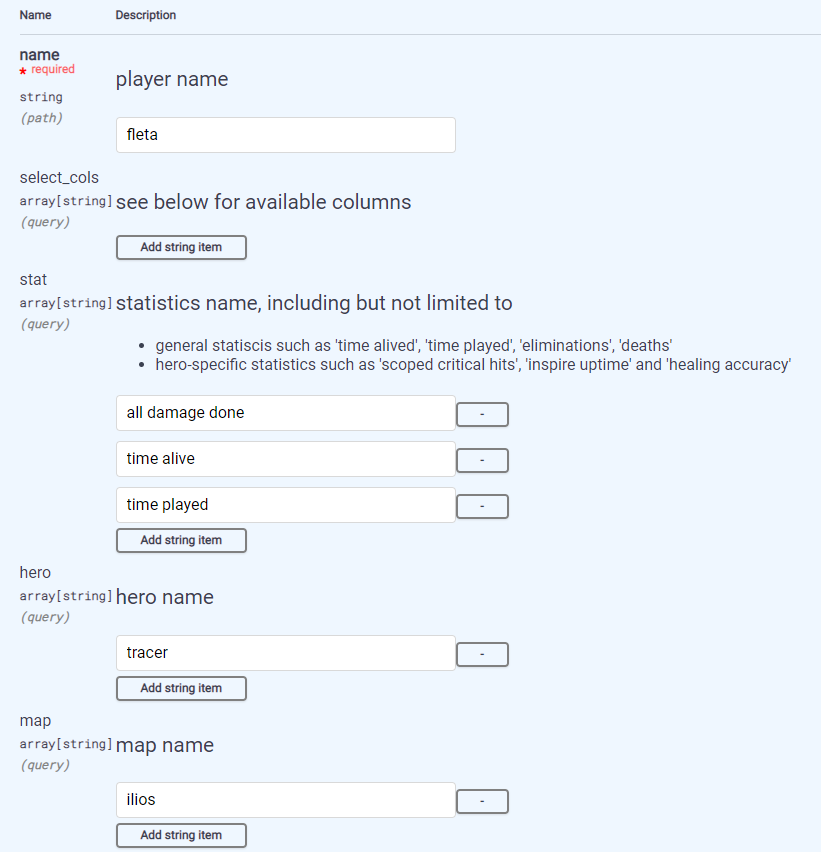

# Overwatcher: Overwatch League Statistics API

`overwatcher` provides API for accessing [Overwatch
League](https://overwatchleague.com/) statistics on match, map and
player level.

Typical questions for the API the answer

- Which season 4 player is the best tracer in terms of average damage
  and sticky bomb hits? (`/player_stats`)

- What is the total earnings for US owl players, and how much is it
  related to age? (`/player_info`)

- As season proceeds, how does sombra players evolve on EMP
  efficiency? (`/matches`)

- In which match did two CP maps have the longest round duration and
  greatest number of rounds? (`/maps`)

The data comes from two sources:

- [Overwatch League Stats
  Lab](https://overwatchleague.com/zh-cn/statslab) including match and
  map statistics for all 4 seasons, currently only season 4 match
  statistics is presented in the app

- [Liquipedia Player Wiki](https://liquipedia.net/overwatch/Players)
  including players’ personal information

## Tehcnologies

All API endpoints and swagger docs are implemented in Python’s
[FastAPI](https://fastapi.tiangolo.com/) framework. Data cleaning and
scraping is done in R with
[data.table](https://rdatatable.gitlab.io/data.table/).

## Available Query Parameters and values

When it comes to match statistics, there are 3 important query
parameters to pre-filter data and limit the analysis scope: stat, hero
and map. For example, we may be interested to know how fleta’s
performance on tracer in Ilios, specifically, the average played time,
hero damage and time alive. Then we can set query parameters on swagger
as



This generates curl commands

```bash
curl -X 'GET' \
  'http://127.0.0.1:8000/player_stat/fleta?stat=all%20damage%20done&stat=time%20alive&stat=time%20played&hero=tracer&map=ilios' \
  -H 'accept: application/json'
```

Below is a list of all available values ordered alphabetically for some
query parameters. Note that all values should be lowercase.

### heroes

- `all heroes`
- `ana`
- `ashe`
- `baptiste`
- `bastion`
- `brigitte`
- `d.va`
- `doomfist`
- `echo`
- `genji`
- `hanzo`
- `junkrat`
- `lucio`
- `mccree`
- `mei`
- `mercy`
- `moira`
- `orisa`
- `pharah`
- `reaper`
- `reinhardt`
- `roadhog`
- `sigma`
- `soldier: 76`
- `sombra`
- `symmetra`
- `torbjorn`
- `tracer`
- `widowmaker`
- `winston`
- `wrecking ball`
- `zarya`
- `zenyatta`

### maps

- `blizzard world`
- `busan`
- `dorado`
- `eichenwalde`
- `hanamura`
- `havana`
- `hollywood`
- `ilios`
- `junkertown`
- `king's row`
- `lijiang tower`
- `nepal`
- `numbani`
- `oasis`
- `rialto`
- `route 66`
- `temple of anubis`
- `volskaya industries`
- `watchpoint: gibraltar`

### stats

- `ability damage done`
- `accretion kills`
- `accretion stuns`
- `adaptive shield uses`
- `air uptime`
- `air uptime percentage`
- `all damage done`
- `amped heal activations`
- `amped speed activations`
- `amplification matrix assists`
- `amplification matrix casts`
- `amplification matrix efficiency`
- `armor - rally`
- `armor provided`
- `assists`
- `average energy`
- `average players per teleporter`
- `average time alive`
- `barrage efficiency`
- `barrage kills`
- `barrier damage done`
- `biotic field healing done`
- `biotic fields deployed`
- `biotic grenade kills`
- `biotic launcher healing explosions`
- `biotic launcher healing shots`
- `biotic orb damage efficiency`
- `biotic orb healing efficiency`
- `biotic orb maximum damage`
- `biotic orb maximum healing`
- `blaster kills`
- `blizzard efficiency`
- `blizzard kills`
- `bob gun damage`
- `bob kills`
- `charge kills`
- `coach gun kills`
- `coalescence healing`
- `coalescence kills`
- `coalesence - damage per use`
- `coalesence - healing per use`
- `concussion mine kills`
- `critical hit accuracy`
- `critical hit kills`
- `critical hits`
- `damage - accretion`
- `damage - barrage`
- `damage - biotic grenade`
- `damage - biotic orb`
- `damage - blizzard`
- `damage - bob`
- `damage - bob charge`
- `damage - boosters`
- `damage - call mech`
- `damage - chain hook`
- `damage - charge`
- `damage - coach gun`
- `damage - coalescence`
- `damage - concussion mine`
- `damage - deadeye`
- `damage - death blossom`
- `damage - deflect`
- `damage - discord orb`
- `damage - dragonblade`
- `damage - dragonblade total`
- `damage - dragonstrike`
- `damage - duplicate`
- `damage - dynamite`
- `damage - earthshatter`
- `damage - emp`
- `damage - fire strike`
- `damage - flashbang`
- `damage - focusing beam`
- `damage - focusing beam - bonus damage only`
- `damage - grappling claw`
- `damage - graviton surge`
- `damage - helix rockets`
- `damage - hyperspheres`
- `damage - jump pack`
- `damage - meteor strike`
- `damage - micro missiles`
- `damage - minefield`
- `damage - molten core`
- `damage - piledriver`
- `damage - pistol`
- `damage - primal rage leap`
- `damage - primal rage melee`
- `damage - primal rage total`
- `damage - pulse bomb`
- `damage - quick melee`
- `damage - rip-tire`
- `damage - rising uppercut`
- `damage - rocket punch`
- `damage - seismic slam`
- `damage - self destruct`
- `damage - sentry turret`
- `damage - shield bash`
- `damage - sonic`
- `damage - steel trap`
- `damage - sticky bombs`
- `damage - storm arrows`
- `damage - swift strike`
- `damage - swift strike dragonblade`
- `damage - tactical visor`
- `damage - total mayhem`
- `damage - venom mine`
- `damage - weapon`
- `damage - weapon charged`
- `damage - weapon hammer`
- `damage - weapon pistol`
- `damage - weapon primary`
- `damage - weapon recon`
- `damage - weapon scoped`
- `damage - weapon secondary`
- `damage - weapon sentry`
- `damage - weapon tank`
- `damage - whole hog`
- `damage absorbed`
- `damage amplified`
- `damage blocked`
- `damage done`
- `damage prevented`
- `damage reflected`
- `damage taken`
- `damage taken - adaptive shield`
- `damage taken - ball`
- `damage taken - tank`
- `deadeye efficiency`
- `deadeye kills`
- `death blossom efficiency`
- `death blossom kills`
- `death blossoms`
- `deaths`
- `defensive assists`
- `deflection kills`
- `direct hit accuracy`
- `discord orb time`
- `dragonblade efficiency`
- `dragonblade kills`
- `dragonblades`
- `dragonstrike efficiency`
- `dragonstrike kills`
- `duplicate kills`
- `dynamite kills`
- `earthshatter efficiency`
- `earthshatter kills`
- `earthshatter stuns`
- `eliminations`
- `emp efficiency`
- `enemies emp'd`
- `enemies frozen`
- `enemies hacked`
- `enemies hooked`
- `enemies slept`
- `enemies trapped`
- `energy maximum`
- `environmental deaths`
- `environmental kills`
- `fan the hammer kills`
- `final blows`
- `fire strike kills`
- `focusing beam accuracy`
- `focusing beam dealing damage seconds`
- `focusing beam kills`
- `focusing beam seconds`
- `frag launcher direct hits`
- `freeze spray damage`
- `grappling claw impacts`
- `grappling claw kills`
- `grappling claw uses`
- `gravitic flux damage done`
- `gravitic flux kills`
- `graviton surge efficiency`
- `graviton surge kills`
- `hammer kills`
- `harmony orb time`
- `heal song time elapsed`
- `healing - biotic grenade`
- `healing - biotic launcher`
- `healing - biotic orb`
- `healing - coalescence`
- `healing - harmony orb`
- `healing - healing boost`
- `healing - healing boost amped`
- `healing - immortality field`
- `healing - inspire`
- `healing - regenerative burst`
- `healing - repair pack`
- `healing - secondary fire`
- `healing - transcendence`
- `healing - weapon`
- `healing - weapon scoped`
- `healing - weapon valkyrie`
- `healing accuracy`
- `healing amplified`
- `healing done`
- `healing received`
- `health recovered`
- `helix rocket kills`
- `hero damage done`
- `high energy kills`
- `hook accuracy`
- `hooks attempted`
- `hyperspheres direct hits`
- `icicle damage`
- `immortality field deaths prevented`
- `infra-sight efficiency`
- `infra-sight uptime`
- `inspire uptime`
- `inspire uptime percentage`
- `jump pack kills`
- `knockback kills`
- `lifetime energy accumulation`
- `match blinks used`
- `mech deaths`
- `mechs called`
- `melee final blows`
- `melee kills`
- `melee percentage of final blows`
- `meteor strike efficiency`
- `meteor strike kills`
- `minefield kills`
- `molten core efficiency`
- `molten core kills`
- `multikills`
- `nano boost assists`
- `nano boost efficiency`
- `nano boosts applied`
- `objective kills`
- `objective time`
- `of rockets fired`
- `offensive assists`
- `overload kills`
- `photon projector kills`
- `piledriver kills`
- `piledriver uses`
- `players halted`
- `players knocked back`
- `players resurrected`
- `players saved`
- `players teleported`
- `primal rage efficiency`
- `primal rage kills`
- `primal rage melee accuracy`
- `primal rage melee efficiency`
- `primal rage melee hits`
- `primal rage melee hits - multiple`
- `primal rage melee ticks`
- `primary fire accuracy`
- `primary fire average level`
- `primary fire hits`
- `primary fire hits hits - level`
- `primary fire ticks`
- `projected barrier damage blocked`
- `projected barriers applied`
- `pulse bomb attach rate`
- `pulse bomb efficiency`
- `pulse bomb kills`
- `pulse bombs attached`
- `quick melee accuracy`
- `quick melee hits`
- `quick melee ticks`
- `rally armor efficiency`
- `recalls used`
- `recon assists`
- `recon kills`
- `rip-tire efficiency`
- `rip-tire kills`
- `rocket barrages`
- `rocket direct hits`
- `rocket hammer melee accuracy`
- `rocket hammer melee average targets`
- `rocket hammer melee hits`
- `rocket hammer melee hits - multiple`
- `rocket hammer melee ticks`
- `roll uptime`
- `roll uptime percentage`
- `roll uses`
- `scoped accuracy`
- `scoped critical hit accuracy`
- `scoped critical hit kills`
- `scoped critical hits`
- `scoped hits`
- `scoped shots`
- `secondary direct hits`
- `secondary fire accuracy`
- `secondary fire hits`
- `secondary fire ticks`
- `self destruct efficiency`
- `self healing`
- `self healing percent of damage taken`
- `self-destruct kills`
- `self-destructs`
- `sentry kills`
- `sentry turret kills`
- `shielding - adaptive shield`
- `shields created`
- `shots fired`
- `shots hit`
- `shots missed`
- `sleep dart hits`
- `sleep dart shots`
- `sleep dart success rate`
- `solo kills`
- `sound barrier casts`
- `sound barrier efficiency`
- `sound barriers provided`
- `soundwave kills`
- `speed song time elapsed`
- `sticky bombs direct hit accuracy`
- `sticky bombs direct hits`
- `sticky bombs kills`
- `sticky bombs useds`
- `storm arrow kills`
- `successful freezes`
- `supercharger assists`
- `supercharger efficiency`
- `tactical visor efficiency`
- `tactical visor kills`
- `tactical visors`
- `tank efficiency`
- `tank kills`
- `teleporter pads destroyed`
- `teleporter uptime`
- `teleporters placed`
- `tesla cannon accuracy`
- `tesla cannon efficiency`
- `tesla cannon hits`
- `tesla cannon hits - multiple`
- `tesla cannon ticks`
- `time alive`
- `time building ultimate`
- `time discorded`
- `time elapsed per ultimate earned`
- `time hacked`
- `time holding ultimate`
- `time played`
- `torbj`
- `total mayhem kills`
- `total time frozen`
- `transcendence efficiency`
- `transcendence healing`
- `transcendence percent of healing`
- `turret damage`
- `turret kills`
- `turrets destroyed`
- `ultimates earned - fractional`
- `ultimates negated`
- `ultimates used`
- `unscoped accuracy`
- `unscoped hits`
- `unscoped shots`
- `valkyrie healing efficiency`
- `venom mine kills`
- `weapon accuracy`
- `weapon kills`
- `whole hog efficiency`
- `whole hog kills`

### players

- `alarm`
- `ameng`
- `anamo`
- `ans`
- `ansoonjae`
- `architect`
- `aspire`
- `assassin`
- `aztac`
- `beast`
- `bebe`
- `bernar`
- `bianca`
- `birdring`
- `blase`
- `bqb`
- `carpe`
- `changsik`
- `checkmate`
- `choihyobin`
- `choisehwan`
- `closer`
- `coldest`
- `colourhex`
- `cr0ng`
- `creative`
- `crimzo`
- `daan`
- `dalton`
- `danteh`
- `decay`
- `develop`
- `diem`
- `doha`
- `dreamer`
- `dridro`
- `edison`
- `eileen`
- `ellivote`
- `elsa`
- `eqo`
- `faith`
- `farway1987`
- `fate`
- `fdgod`
- `fearless`
- `feath5r`
- `fielder`
- `fire`
- `fits`
- `fleta`
- `flora`
- `frdwnr`
- `friday`
- `funnyastro`
- `fury`
- `ga9a`
- `gaebullssi`
- `gangnamjin`
- `gargoyle`
- `gator`
- `gesture`
- `glister`
- `godsb`
- `guxue`
- `gwangboong`
- `hadi`
- `hanbin`
- `happy`
- `hawk`
- `heesu`
- `highbee`
- `hotba`
- `hybrid`
- `hydration`
- `idk`
- `im37`
- `ir1s`
- `ivy`
- `izayaki`
- `jake`
- `jecse`
- `jerry`
- `jihun`
- `jimmy`
- `jinmu`
- `jjanggu`
- `jjonak`
- `joobi`
- `kaan`
- `kai`
- `kalios`
- `kaneki`
- `kariv`
- `kellex`
- `kevster`
- `krystal`
- `ksf`
- `lastro`
- `lateyoung`
- `leave`
- `leejaegon`
- `linkzr`
- `lip`
- `logix`
- `m1ka`
- `mag`
- `mandu`
- `mano`
- `marve1`
- `masaa`
- `mcd`
- `michelle`
- `mirror`
- `mmonk`
- `molanran`
- `molf1g`
- `molly`
- `moth`
- `muze`
- `mykaylee`
- `myunb0ng`
- `na1st`
- `naga`
- `neptuno`
- `nero`
- `nisha`
- `oge`
- `onigod`
- `pelican`
- `piggy`
- `profit`
- `punk`
- `rapel`
- `rascal`
- `rio`
- `ripa`
- `roolf`
- `sado`
- `seominsoo`
- `shax`
- `shockwave`
- `showcheng`
- `shredlock`
- `shu`
- `shy`
- `silver3`
- `skewed`
- `slime`
- `smurf`
- `sp9rk1e`
- `space`
- `sparkr`
- `stand1`
- `striker`
- `super`
- `ta1yo`
- `takoyaki`
- `tarocook1e`
- `teru`
- `tobi`
- `toyou`
- `tsuna`
- `ttuba`
- `twilight`
- `valentine`
- `vestola`
- `viol2t`
- `void`
- `whoru`
- `wya`
- `yaki`
- `yakpung`
- `yveltal`

### stages

(Starting from the third stage, owl stats lab did not distinguish
between regular season and playoffs)

- `season1 stage1`
- `season1 stage1 title`
- `season1 stage2`
- `season1 stage3`
- `season1 stage4`
- `season1 playoff`
- `season2 stage1`
- `season2 stage1 title`
- `season2 stage2`
- `season2 stage2 title`
- `season2 stage3`
- `season2 stage3 title`
- `season2 stage4`
- `season2 playoff`
- `season3`
- `season4`

### map types

- `control`
- `hybrid`
- `payload`
- `assault`
